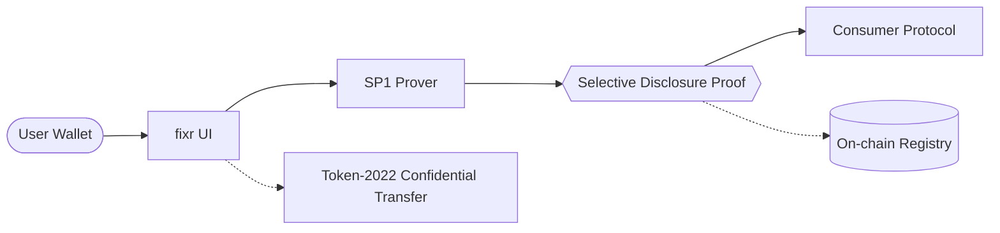

<p align="center">
  
</p>

<p align="center">
  
  
  
  
  
  
</p>

<p align="center">
  <a href="https://fixr.red"></a>
  <a href="https://x.com/fixrprotocol"></a>
</p>

# fixr --- In the red light, only what matters appears.

ZK Selective Disclosure Protocol on Solana — develop only what matters.

`fixr` is a selective disclosure toolkit for Solana. Users publish commitments
instead of raw data, generate proofs that satisfy a predicate, and let consumer
programs gate access without ever reading the underlying balance or transaction
history. The protocol combines an SP1-style prover with Token-2022 Confidential
Transfer so that gated actions can stay encrypted end to end.

## Architecture



The on-chain registry lives in `programs/fixr_core`. It stores a commitment for
every policy, anchors proof hashes into PDAs, and exposes CPI entrypoints that
other Solana programs can call to verify a predicate before acting on a user.

## Features

| Capability | Crate / package | Status |
|------------|-----------------|--------|
| Selective disclosure policies | `programs/fixr_core` | Stable |
| Deterministic prover stub | `crates/zk_prover` | Stable, SP1 backend is queued |
| TypeScript client | `sdk` | Stable |
| Token-2022 CPI wrapper | `programs/fixr_core` | Stable |
| CLI examples | `examples/` | Stable |

## Installation

```bash
git clone https://github.com/velyadotdev/fixr.git
cd fixr
cargo build --workspace
cd sdk && npm install && npm test
```

## Usage

```ts
import BN from 'bn.js';
import { createClient, solToLamports } from './sdk/src';

const { prover, disclosure } = createClient();
const predicate = disclosure.minSol(100);
const blinding = new Uint8Array(32).fill(42);

const proof = prover.prove({
  predicate,
  blinding,
  witness: {
    balanceLamports: solToLamports(250),
    saltHex: 'c0ffee',
  },
});

console.log(Buffer.from(proof.proofHash).toString("hex"));
```

The same call pattern compiles against the stub prover today and against the SP1
backend when it is wired in.

## Repository layout

```
fixr/
  programs/fixr_core/        anchor program and instructions
  crates/zk_prover/          deterministic prover skeleton
  sdk/                       typescript client and tests
  examples/                  simple proof and whale gating demos
  scripts/                   deploy and proof inspection helpers
  docs/                      architecture, getting started, disclosure types
```

## Links

- Website: https://fixr.red
- X: https://x.com/fixrprotocol

## License

Released under the MIT License. See `LICENSE` for details.

